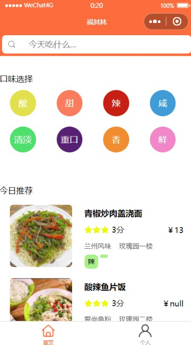
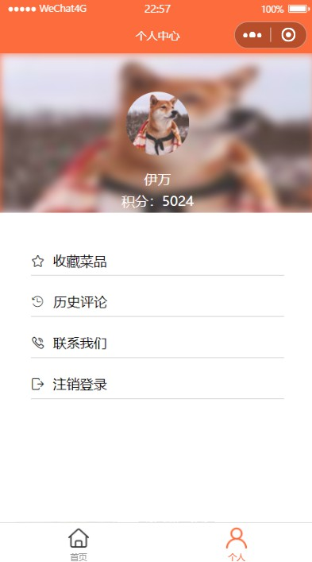
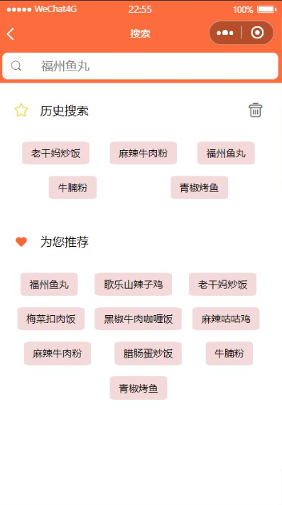
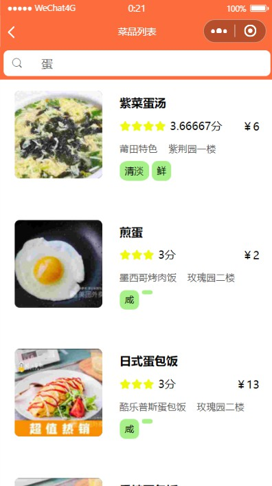
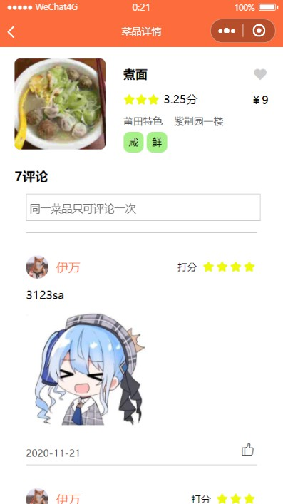
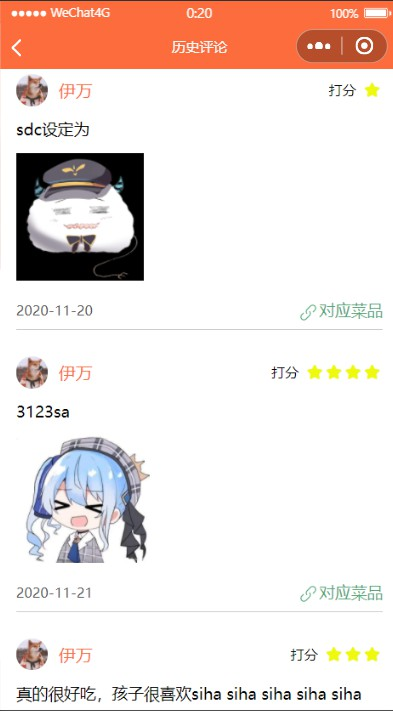

# FzuMichelin

## 简介
软工的大作业，微信小程序端的福大菜品：福其林  

## 使用
- 微信搜索福其林  
- 小程序码  

## 示例

  

    
登录后的首页

    
  

  

    
个人空间

    
  

  

    
搜索

    
  

  

    
菜品列表

    
  

  

    
菜品详情

    
  

  

    
历史评论

    
  

## 总结
团队有凝聚力，每个人对于项目有热情，愿意将自己负责的部分打磨到最好，形成一种环绕着的氛围，是整个项目成功的关键。除此之外，合理的团队组成：不仅要有熟悉开发流程的负责人跟各司其职的成员，还要有明确的赏罚细则以激励成员；完善的开发规范：风格统一、功能齐全的原型，清晰明确、覆盖原型的接口文档等也不可或缺。小程序虽小，但作为团队项目练习合作却是再好不过，从立项开发到上线推广，开发平台都有相应界面，软工这门课跨一整年，改成10学分，或许会更好...
对于我个人来说，微信小程序从开始学习到项目完成，前后历时两个多月，github commit 30多次，确实挺累的。不过小程序比起一般web开发确实相对方便，还挺好玩。开发者工具更几乎是vscode套皮。最开心的时候还是跟团队成员讨论bug的时候，每解决一个问题就像发现一个新大陆，每实现了一个新功能也很有成就感，只是时间紧迫，很多想法都没有时间实现，预定要试的东西也只能作罢。
